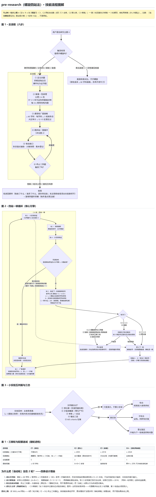
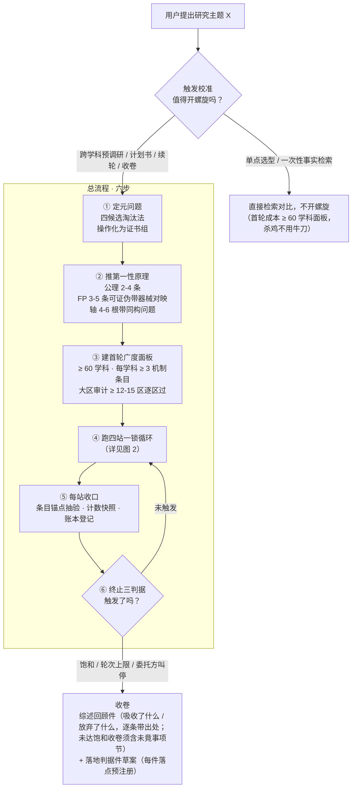
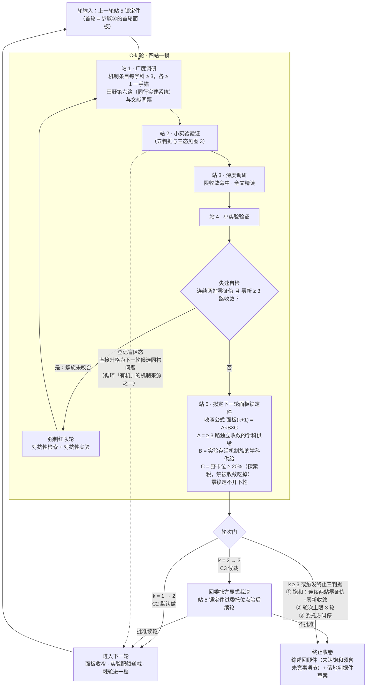
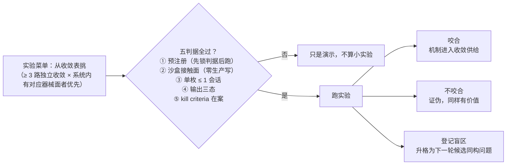
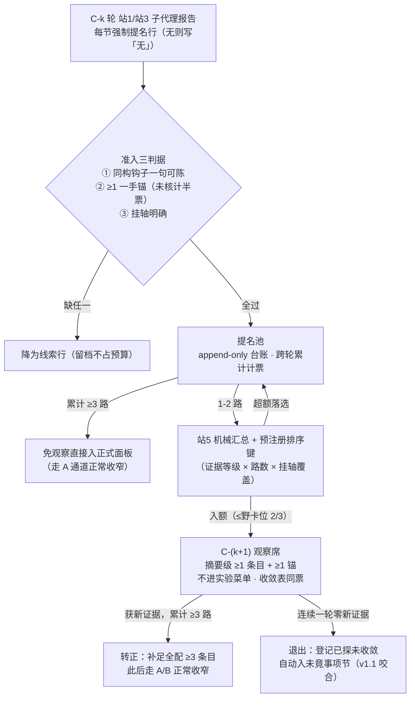

# pre-research（螺旋四站法）· 技能流程图解 + 轮次上限设计分析

> 本文是对一个「预调研」Agent Skill（v1.0.0，2026-10-01）的流程图解与设计分析。
> 该技能的职责：把任意研究主题推进为**多轮收缩的跨学科预调研**——
> 广度调研 → 小实验验证 → 深度调研 → 小实验验证 → 拟定新的广度调研范围，循环收窄，
> 直至锁定前沿学科面或触发饱和收卷。全程产物落盘候批、实验打在沙盒接触面、零越权执行。

---

## TL;DR：轮次上限到底是不是「2 轮」？

**不是 2 轮，是一个「2 + 1 + 3」双层门结构：**

| 层级 | 规则（技能原文位置） | 含义 |
|---|---|---|
| 自动轮 | 「轮次制：C1 全做、C2 默认做、C3 候裁」（§四） | 前 2 轮**不需要问人**，直接跑 |
| 候裁轮 | 「C3 候裁」+「每轮站 5 锁定件过委托位点验后续轮」（§四） | 第 3 轮必须回委托方显式裁决 |
| 硬顶 | 「终止三判据 ② 轮次上限（3 轮，续轮候裁）」（§七） | 3 轮封顶；之后每次续轮都要再候裁 |

所以体感上的「上限 2 轮」= **代理最多自主花 2 轮，第 3 轮起每一轮都要回到人**。
另有一个易混点：失速自检与饱和判据里的「**连续两站**零证伪」是**站级**计数（一轮之内有 4 个站），
不是「两轮」——两处「2」含义完全不同。

实证：该技能 2026-10-02 在作者工作区的首次实跑，走的就是「C1/C2 螺旋两轮」，与设计一致。

---

## 图 1 · 总流程（六步）

**几个入口纪律**（防止面板「看起来很全」）：

- 选学科只按「该学科解决过与本轴同构的问题」，**禁按学科目录铺**（判例：按目录铺被评「浮于表面」）；
- 大区审计按知识体系区划逐区过，教育 / 质量工程 / 体育训练等「非显学区」最易整片漏检（判例：按文献分布自查漏 12 门）；
- 学科来源三条：文献轴 + 田野第六路（同行实建系统，票与文献同筛）+ 本地既有调研卷继承。

---

## 图 2 · 四站一锁循环（核心引擎）

要点：**站 5 是循环的显式收尾步（PDCA 的 Act 位）**。回边不是「感觉该再来一轮」，而是由
锁定件（预注册面板 + 时新棘轮推进一档）强制——防滑回线性瀑布。

---

## 图 3 · 小实验五判据与三态

五判据全过才算「小实验」，否则只是演示：

---

## 图 4 · 涌现提名（v1.2，每轮站5 生效）

收窄公式 A×B×C 对「已涌现但未证实」的单路新学科存在结构性盲区——A 要 ≥3 路收敛、B 要实验存活，苗子两条都不占。v1.2 开结构化通道：**收割进池 → 计票累积 → 占野卡位进下一轮 → 转正或退出（进未竟事项）**，收窄不再等于遗忘。

---

## 表 1 · 三棘轮与配额递减（随轮进档）

| 进档项 | C1（首轮） | C2（默认） | C3（候裁） | C4+（续轮再候裁） |
|---|---|---|---|---|
| 时新棘轮（文献年代下限） | 不限年代 | ≥ 2005 | ≥ 2018 | ≥ 2024 |
| 深度棘轮 | 摘要级（每学科 ≥ 3 机制，各 ≥ 1 一手锚） | 全文精读（限收敛命中） | 方法论级（判据可复算） | 边缘扫尾 |
| 实验配额 | 5 | 3 | 2 | 1 |
| 面板规模 | ≥ 60 学科 | A×B×C 收窄 | 继续收窄 | 野卡 ≥ 20% 不许被收敛吃掉 |

> 注：时新棘轮的四档映射（轮 1 → 轮 4）是技能明文；深度棘轮同为四档，按「每轮进一档」同构推进。
> 有意思的细节：**棘轮梯子留了 4 级余量，但轮次门把 C4 挡在候裁之后**——梯子是给「值得续轮」
> 的场景预备的，不是给「默认多跑一轮」预备的。

---

## 为什么把「自动轮」压在 2 轮？——四条设计理由

1. **成本不对称**。首轮 ≥ 60 学科 × 每学科 ≥ 3 机制条目 ≈ 180+ 条带一手锚的条目；
   历史判例里连收尾轮都要实耗 2.5–3.5 个会话。每一轮都是「四站 + 双实验」的重负载，
   不加问询的轮次越多，失控成本敞口越大。

2. **设计即收敛，轮数天然不该多**。收窄公式是乘法（A×B×C），实验配额递减（5→3→2→1），
   两根棘轮逐轮进档。到 C3 时深度已到方法论级、时新已压到 ≥ 2018——继续「再来一轮同款」
   边际收益趋零。螺旋被设计成 2–3 轮内收敛，而不是无限精修。

3. **防沉没成本陷阱**。研究循环天然有「再来一轮就好了」的冲动。终止三判据
   （饱和 / 轮次上限 / 叫停）+ 失速自检（零证伪 → 强制红队轮，而不是原样加轮）
   把「加轮」从默认行为改成显式裁决：要么拿出新收敛的证据，要么换打法，要么收卷。

4. **委托方主权（零越权执行）**。全技能的基调是「落盘候批、预注册先于实验、零生产写」。
   C3 候裁和「站 5 锁定件过委托位点验后续轮」是同一主权的轮级体现——
   代理最多自主花 2 轮的预算，第 3 轮起必须回到人。

**如果想改上限**：改 `SKILL.md` 两处即可——§四 的「轮次制」行（C1/C2/C3 的权限分配）
和 §七 终止三判据② 的「轮次上限（3 轮，续轮候裁）」。但按该技能自身的经济学
（面板成本 × 边际递减），更合理的扩法是**多用「续轮候裁」按需加轮**，而不是抬高自动上限。

---

## 来源与版本

- 图解对象：pre-research 技能 v1.0.0（2026-10-01，agent_created）
- 2026-10-02 v1.1.0：技能新增「**未竟事项强制披露**」——凡未达饱和（判据①）而收卷（轮次上限②/委托方叫停③），综述回顾件必须增设未竟事项节：未收敛同构问题（带差额：还差几路独立命中）/ 登记盲区实验 / 野卡未探面 / 棘轮未走完档位，每条带现状与续轮接续建议；禁「基本收敛」类掩盖措辞。饱和收卷可免。
- 2026-10-02 v1.2.0：新增「**涌现提名**」机制（用户令：子代理报告涌现的好苗子强制收集入后续轮选科，**每轮站5 生效非仅首轮**）——报告强制提名行 → 提名池（append-only 计票，提名路与文献/田野同票）→ 累计 ≥3 路直接入面板；1-2 路按预注册排序键占野卡位 ≤2/3 成观察席（摘要级、不进实验菜单、收敛表同票）→ 转正补全配或退出（自动入未竟事项节）。野卡其余 ≥1/3 保持自由探索。
- 2026-10-05 v1.4.0：**预锁复锁纪律**（预注册摸底数字=候选预锁值，执行日步 0 当日复算逐位对账；生产面活跃用两级门 Tier-1 结构谓词判死/Tier-2 点值漂移只登记）+ **实验配额超配候裁**（新必需轴超配合法但须收卷件如实登记且判据不回改）+ **棘轮末档声明**（档位序有限封顶，末档后持平合法）。判例：exp-C2-AX5 登记盲区（预锁则/表冲突被门拦下）→ C3 干净收口。
- 2026-10-07 v1.5.0：**失配标注强制**（用户判据=Gentner 结构映射理论：同构只发借用许可，**失配才决定怎么借、借了哪里会坏**；「完全对应」恰是词面撞车信号）——每条借入机制必须标注「原生域前提 vs 本域现状：缺什么支撑/多什么干扰+预期断裂形态」；寻不得写「未寻得失配」并降半票（mere-appearance 嫌疑不入实验菜单优先序）；同构钩子须写关系结构禁词面匹配；收敛表每路增失配位（深读校准回填）；候选行未竟附共性失配句。实证=C3/C4 真跑放弃清单 40+ 项均为迟到失配发现。
- 方法论源流：某演化机制预调研计划书 v1.2（2026-10-01）及其修订史
  （v1 → v1.1 补田野第六路 → v1.2 循环显式化 + 结构审计补录 → v1.3.0 反噬检查款+判定序+kill 硬规则 → v1.4.0 复锁/两级门/超配候裁 → v1.5.0 失配标注）
- 2026-10-07 v1.5.1：**注意力补丁**（AI 注意力工程扫场 6 项全修）——调研员/深读员/预注册员/实验员 ask 三段式重构（顶部编号义务清单+落盘前逐项自检，治长义务清单中段遗忘）；子代理自报合规计数 selfCheck+引擎对账（谎报登记）；失配标注两段式（表内短标+脚注详注）；回执必含判定序四行（kill/反噬/咬合/空转）；判据读取精确到节勿整读；闲时版续跑首动作注意力重锚。
- 2026-10-07 v1.6.0：**矿脉学科**（用户裁 β）——「极端对口学科的深度发掘缺失」盲区全修：识别门三触发器（跨 ≥2 轴命中/全条目「未寻得失配」/提名深掘标记）→ 站3 加强形态按**五维清单**挖矿脉档案（机制全集/失败化石/参数空间/版本演进史/对比边界）→ **矿脉席**（不计收敛路/不占 A·B 收敛供给/不占探索税/与 A 并存票权不叠加——防单源绑架，≥3 独立路门不动）。判例：C3/C4 的数据库 IVM 簇即漏网矿脉（两轮 10 路最富产出系偶然非机制）。
- 实证参照：2026-10-02 首次实跑（C1/C2 两轮收口）；2026-10-02~05 工作流真跑四轮（C1~C4，特批终轮未竟 0 条收官——五轴全结构必需 46 路）
- 本文所有流程均忠实转写自技能原文；判例细节已做去标识化处理

## License

[MIT](LICENSE)
